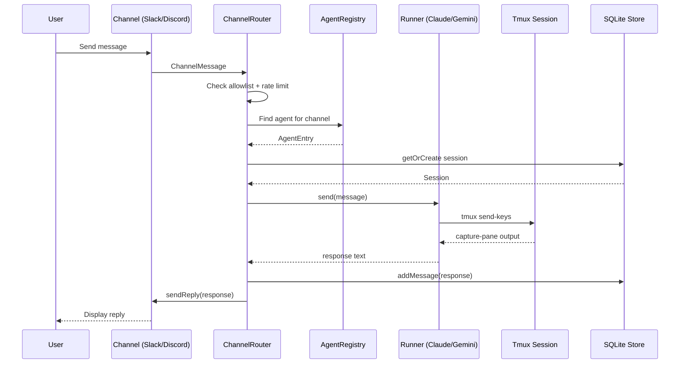
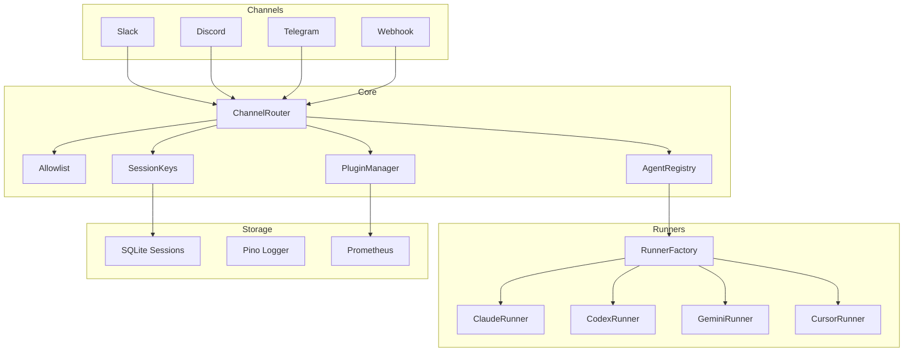

# Agent Bridge — Design Document

## 1. Problem Statement

AI coding agents (Claude, Codex, Gemini, Cursor) run as interactive CLI sessions that require a terminal. Teams need to:

1. **Interact remotely** — send tasks from Slack, Discord, or webhooks without SSH access
2. **Monitor status** — see what the agent is doing in real time
3. **Manage multiple agents** — route different channels to different agents
4. **Survive restarts** — session history and state must persist
5. **Extend behavior** — add custom logic via plugins without forking

Agent Bridge solves all five by sitting between messaging channels and agent CLI sessions.

---

## 2. System Design

### 2.1 Layered Architecture

```
┌─────────────────────────────────────────────────────┐
│                   Presentation Layer                  │
│   Dashboard UI  ·  REST API  ·  WebSocket  ·  CLI    │
├─────────────────────────────────────────────────────┤
│                   Channel Layer                       │
│   Slack  ·  Discord  ·  Telegram  ·  Webhook          │
│   ChannelRouter  ·  Allowlist  ·  Rate Limiter         │
├─────────────────────────────────────────────────────┤
│                   Orchestration Layer                  │
│   AgentRegistry  ·  SessionKeys  ·  WakeSleep          │
│   PluginManager  ·  CronScheduler                      │
├─────────────────────────────────────────────────────┤
│                   Agent Layer                         │
│   RunnerFactory  ·  BaseRunner  ·  TmuxBridge          │
│   ClaudeRunner · CodexRunner · GeminiRunner · Cursor   │
├─────────────────────────────────────────────────────┤
│                   Storage Layer                       │
│   SQLite Sessions  ·  Pino Logger  ·  Config Loader    │
│   PrometheusMetrics  ·  ConfigReloader                 │
└─────────────────────────────────────────────────────┘
```

### 2.2 Data Flow



### 2.3 Component Interaction



---

## 3. Key Design Decisions

### 3.1 Tmux as Agent Container

**Why tmux?** AI CLI agents expect an interactive terminal. Tmux provides:
- Process isolation (each agent gets its own session)
- Named sessions for lookup (`tmux has-session -t <name>`)
- Output capture (`tmux capture-pane -p`)
- Input injection (`tmux send-keys`)
- Survives SSH disconnects

**Trade-off**: Requires tmux installed on the host. Not containerizable without tricks.

### 3.2 Runner Abstraction

Each CLI agent has different flags, output formats, and completion markers:

| Runner | Command | Completion Markers | Timeout |
|--------|---------|-------------------|---------|
| Claude | `claude --dangerously-skip-permissions` | `$`, `>`, `claude>` | 120s |
| Codex | `codex --full-auto` | `$`, `>`, `codex>` | 180s |
| Gemini | `gemini [--model M]` | `$`, `>`, `gemini>` | 120s |
| Cursor | `cursor --agent` | `$`, `>`, `cursor>` | 150s |

BaseRunner provides shared tmux interaction logic. Each subclass only defines:
- `buildCommand()` — CLI invocation string
- `getCompletionMarkers()` — how to detect response end
- `getTimeout()` / `getPollInterval()` — timing calibration

### 3.3 Channel Abstraction

All channels implement the same interface:

```typescript
interface Channel {
  name: string;
  start(): void | Promise<void>;
  stop(): void | Promise<void>;
  onMessage(handler: MessageHandler): void;
}
```

The `ChannelRouter` dispatches incoming `ChannelMessage` objects to a handler function. This decouples channel-specific code from agent interaction logic.

### 3.4 Plugin Lifecycle

Plugins hook into 5 events:

```
onLoad      → called once during startup
onMessage   → called for every incoming message
onResponse  → called for every agent response
onCron      → called when a cron job fires
onShutdown  → called during graceful shutdown
```

All hooks are optional. The PluginManager iterates registered plugins and calls each hook.

### 3.5 SQLite for Session Persistence

In-memory sessions are lost on restart. SQLite provides:
- WAL mode for concurrent reads
- Foreign keys for message→session integrity
- Index on `(sender_id, status)` for fast sender lookup
- `cleanExpired(ttlMs)` for automatic TTL expiry

Schema:

```sql
sessions (id, sender_id, channel, status, created_at, updated_at)
messages (id, session_id, role, content, timestamp)
```

### 3.6 Wake/Sleep Protocol

Agents consume resources even when idle. The `WakeSleepController`:
1. Starts in **sleep** state
2. Wakes on incoming message (`wake()`)
3. Records activity on each interaction (`recordActivity()`)
4. Detects idle state after configurable timeout (`isIdle()`)
5. Auto-sleeps to free resources (`checkAndSleep()`)

### 3.7 Structured Logging

Pino provides:
- JSON output for production (machine-parseable)
- Pretty-print for development (human-readable)
- Subsystem tagging (`[gateway/server]`, `[agent/lifecycle]`)
- Child loggers for operation-scoped context
- Level filtering (debug/info/warn/error)

### 3.8 Error Hierarchy

```
AgentBridgeError (base)
├── AgentError        — agent crash, timeout, unresponsive
├── ConfigError       — invalid YAML, missing required fields
├── AuthError         — invalid token, forbidden (401/403)
├── SessionError      — session not found, already closed
└── ChannelError      — channel disconnected, send failure
```

All errors carry a `code` string and optional `context` object. `formatErrorResponse()` converts any error into a structured JSON response.

---

## 4. Security Model

| Layer | Mechanism |
|-------|-----------|
| API | Bearer token authentication |
| Channels | Per-channel allowlists |
| Users | Per-user allowlists |
| Rate | Sliding-window rate limiter per user |
| Dashboard | Unauthenticated (local-only by default) |
| Agent | Runs with user-level permissions |

**Future**: JWT with refresh tokens, role-based access (admin/operator/viewer).

---

## 5. Monitoring

### Prometheus Metrics

```
# Counters
messages_total      — total messages received
responses_total     — total agent responses
errors_total        — total errors

# Gauges
active_sessions     — currently active sessions
uptime_seconds      — gateway uptime
agent_alive         — 1 if agent is running, 0 otherwise
```

### Config Reloader

Uses SHA-256 hash comparison. On file change:
1. Compute new hash
2. Compare with stored hash
3. If different, fire registered callbacks
4. Update stored hash

---

## 6. Testing Strategy

4-layer test pyramid:

| Layer | What | Count |
|-------|------|-------|
| **Unit** | Pure logic, no I/O | 109 |
| **E2E** | Real server boot, full request lifecycle | 14 |
| **API** | Schema validation, auth enforcement | 9 |
| **Browser** | Dashboard HTML/CSS/JS structure | 4 |
| **Total** | | **166** |

All tests run in < 600ms with Vitest.

---

## 7. Future Work

See [roadmap/gap-closure.md](roadmap/gap-closure.md) for full details.

Priority items:
1. **Real channel implementations** — Discord.js, Telegram Bot API (currently stubs)
2. **GitHub Actions CI** — lint, typecheck, test on every push
3. **Docker packaging** — single-container deployment
4. **JWT auth** — multi-user with roles
5. **React dashboard** — replace static HTML with interactive control panel
